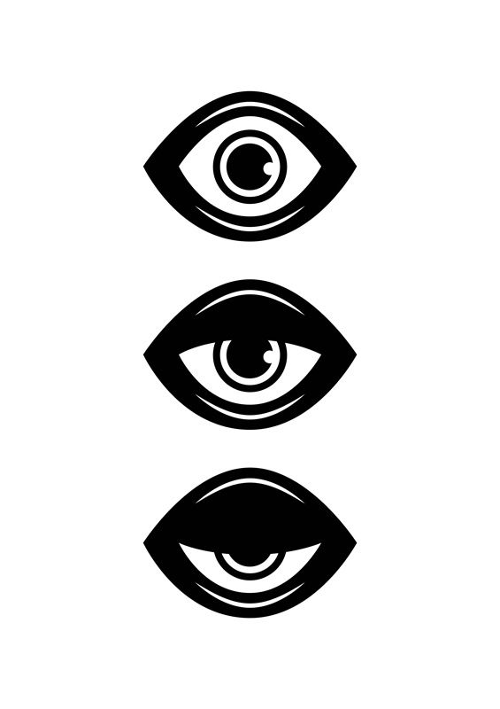

# The Three Testaments

<figure markdown="span">
  { width="300" }
  <figcaption>The Symbol of the Three Testaments</figcaption>
</figure>

## Overview
The Three Testaments is the most commonly-worshipped god in Chamrousse. As an abstract deity, it is depicted as either three separate gods (known as *The Triplets*) or as three aspects of the same god (known as *The Trinity*). *Tripletism* is official representation recognized by the Temple of the Three Testaments in Chamrousse, though the local priests will welcome any variation of the faithful.

The Three Testaments are a manifestation of three core concepts that guide its faithful:

1. "Exalt Thyself"
2. "Exalt Thy Neighbor"
3. "Exalt Thy Village"

The exact meaning of the Testaments, their order, and relative importance have led to multiple schisms and civil wars between the faithful throughout history. As a general rule, however, civilized settlements welcome adherents to the Testaments, as they tend to make good citizens in polite society.