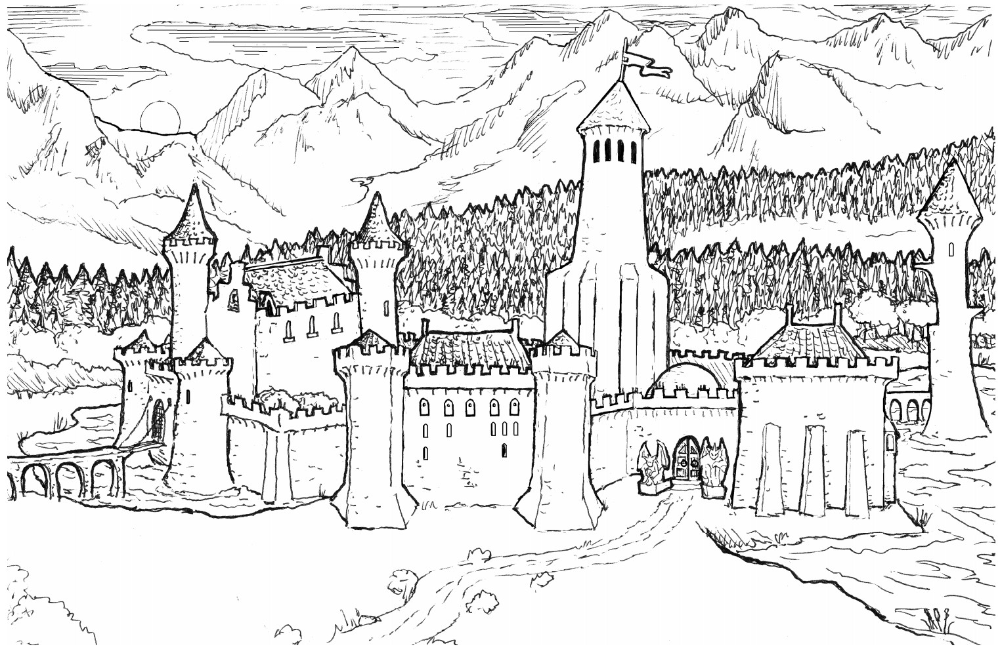

# Castle Xyntillan
A day's travel North of Chamrousse, the road passing through the mountains branches. The well-traveled path leads to the rest of the Northern Reaches, but the path less-traveled leads through a mountain valley. On the shores of a crystal-clear lake found here, one may find the crumbling parapets and fantastic towers of Castle Xyntillan.

<figure markdown="span">
  { width="800" }
  <figcaption>Castle Xyntillan's exterior, showing the gatehouse to the courtyard and main entrance</figcaption>
</figure>

## History
The PCs have begun stitching together pieces of the Castle's history. What they already know is:

* The Castle has stood for hundreds of years
* It was originally the seat of power in the region before the current monarchy absorbed Chamrousse and the nearby villages
* It was (and still technically is) owned by the Xyntillans, who are rumored to be immortal
* Somewhere within the Castle lies a hoard (or hoards) of priceless treasures that the Xyntillans have "acquired" over the centuries.